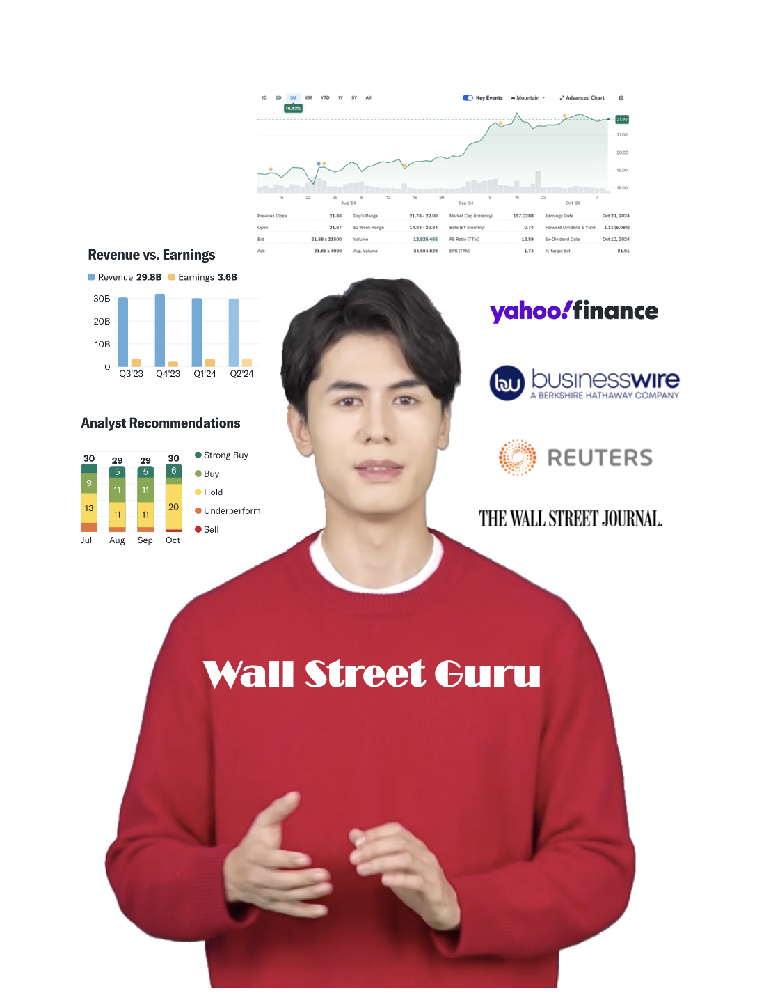

# GenAIWorldCup - Wall Street Guru
This Repos contains deliverable for Databricks GenAI World Cup Hackathon. We created an interactive Wall Street Financial Guru (Avatar) who can provide financial insight and realtime stocks info for companies. This tool can be used as a Chatbot Avatar for Wall Street Investment Firm or as a Chatbot Avatar for a company's Investor Relation application.

* hackathon: https://hackathon.stackup.dev/web/events
* discord: https://go.d3v.gg/genaiwc-databricks-discord

## Deliverables
* Video: TBD
* Repos: https://github.com/chrisATTCDO/GenAIWorldCup

## Team: AT&T - CDO
  

Thank you, [Abhay Dabholkar](https://www.linkedin.com/in/abhay-dabholkar-57654113/) for guidance and coordinating Databricks SME and resources to help make the delivery possible and ontime.

## Project Background
  
  

## Architecture

## RAG Pipeline using Databricks Vector Search and MLFlow Models Evaluation

## Stock Exection Agent Based on Mosaic AI Agent Framework
We used Databricks Agent Tools to implement on-demand stocks transactions.
  * Get Realtime Stock Quote - How is Apple performing?
  * Buy some shares of stock - Grab me 100 shares of AT&T.
  * Sell some shares of stock - Sell 15 shares of Testla.
  * Get recent transaction history - What are my latest transactions?

  
  

Amazingly, user can just specify a company and the agent (LLM) will automatically convert the company to a stock symbol to pass to the appropriately invoked function to fetch realtime stock price.

  

## Model Fine-tuning
Prepared Dataset with thousands of files representing Financial, News, Insight, etc for each Company

  

Databricks simplified the model tuning process with UI driven interface. We wanted to finetune with Continued-Pretrain option to see if accuracy and potentially speed can be improved.

  

## Databricks Technology Incorporated into Project
* Databricks Repos – Realtime notebooks sharing, collaboration, and tracking
* Unity Catalog – Store Tables, functions, models, data volumes
* Delta Sharing – Sample public datasets
* Databricks Vector Search – Vectorized data index for RAG pipeline 
* Interactive Cluster and SQL Warehouse – Compute for interactive notebooks collaboration and sql functions
* Databricks Jobs – Execute ETL pipelines on recurring schedule
* Databricks Model Serving and Marketplace
  * DBRX
  * Mosaic MPT Models
  * Llama 3.1
* Databricks Playground – Evaluate LLMs
* Databricks MLflow - Tracks and manages the experiments and models deployments 
* Mosaic Agent Framework – Stock RAG pipeline and Stock Execution Agent to perform various on-demand operations
* Agent Evaluation – Evaluate models accuracy and performance
* Databricks Guardrails - Safety Filter for LLM
* Mosaic AI Model Serving – Host RAG models and Agent models
* Databricks Apps – Deployed Streamlit Application

## Attribution

#### Databricks Resources
* https://ai-cookbook.io/
* https://ai-cookbook.io/10-min-demo/mosaic-ai-agents-demo-dbx-notebook.html
* https://ai-cookbook.io/10-min-demo/Mosaic-AI-Agents-10-Minute-Demo.html
* https://docs.databricks.com/en/_extras/notebooks/source/machine-learning/structured-data-for-rag.html
* blog: https://www.databricks.com/blog/what-is-a-data-intelligence-platform

#### Python Development Resources
* https://stockanalysis.com/list/nasdaq-stocks/
* https://github.com/ranaroussi/yfinance/tree/main
* https://finance.yahoo.com/
* https://notebook.community/tdrussell/stocktwits_analysis/stocktwits_analysis
* https://stackoverflow.com/questions/42024747/how-to-download-data-from-stocktwits
* https://github.com/bilardi/stocktwits-collector/tree/master
* https://github.com/tbienias/PyTwits/blob/master/docs/examples/main.py
* https://github.com/Pratyusha23/shell_script_webscraping

#### Images/Graphic Resources
* AI Image Generator: https://www.canva.com/ai-image-generator/ 
* Guru Icon Vectors by Vecteezy : https://www.vecteezy.com/free-vector/guru-icon
* FavIcon Converter: https://favicon.io/favicon-converter/ 
