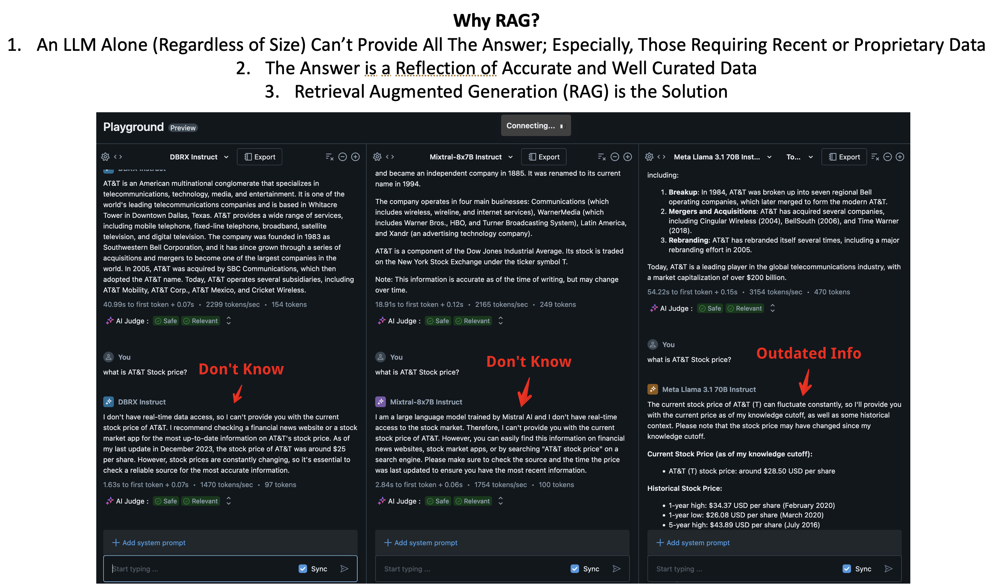

# GenAIWorldCup - Wall Street Guru
This Repos contains deliverable for Databricks GenAI World Cup Hackathon. We created an interactive Wall Street Financial Guru (Avatar) who can provide financial insight and realtime stocks info for companies. This tool can be used as a Chatbot Avatar for Wall Street Investment Firm or as a Chatbot Avatar for a company's Investor Relation application.

* hackathon: https://hackathon.stackup.dev/web/events
* discord: https://go.d3v.gg/genaiwc-databricks-discord

## Deliverables
* Video: TBD
* Repos: https://github.com/chrisATTCDO/GenAIWorldCup

## Team: AT&T - CDO

## Project Background
  
  
  

## Architecture

## Installation and Setups

## Attribution

#### Databricks Resources
* https://ai-cookbook.io/
* https://ai-cookbook.io/10-min-demo/mosaic-ai-agents-demo-dbx-notebook.html
* https://ai-cookbook.io/10-min-demo/Mosaic-AI-Agents-10-Minute-Demo.html
* https://docs.databricks.com/en/_extras/notebooks/source/machine-learning/structured-data-for-rag.html
* blog: https://www.databricks.com/blog/what-is-a-data-intelligence-platform

#### Python Development Resources
* https://stockanalysis.com/list/nasdaq-stocks/
* https://github.com/ranaroussi/yfinance/tree/main
* https://finance.yahoo.com/
* https://notebook.community/tdrussell/stocktwits_analysis/stocktwits_analysis
* https://stackoverflow.com/questions/42024747/how-to-download-data-from-stocktwits
* https://github.com/bilardi/stocktwits-collector/tree/master
* https://github.com/tbienias/PyTwits/blob/master/docs/examples/main.py
* https://github.com/Pratyusha23/shell_script_webscraping

#### Images/Graphic Resources
* AI Image Generator: https://www.canva.com/ai-image-generator/ 
* Guru Icon Vectors by Vecteezy : https://www.vecteezy.com/free-vector/guru-icon
* FavIcon Converter: https://favicon.io/favicon-converter/ 
